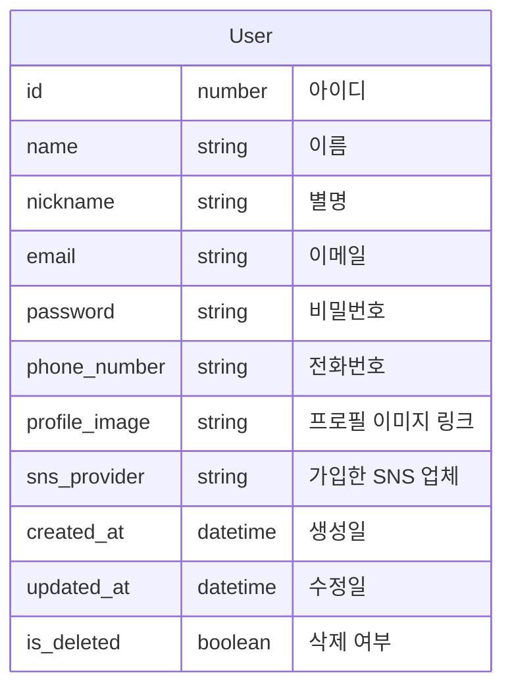
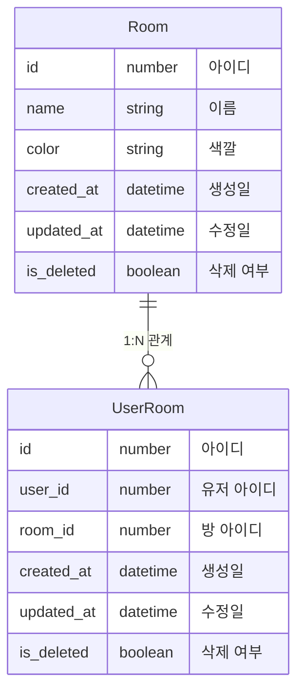
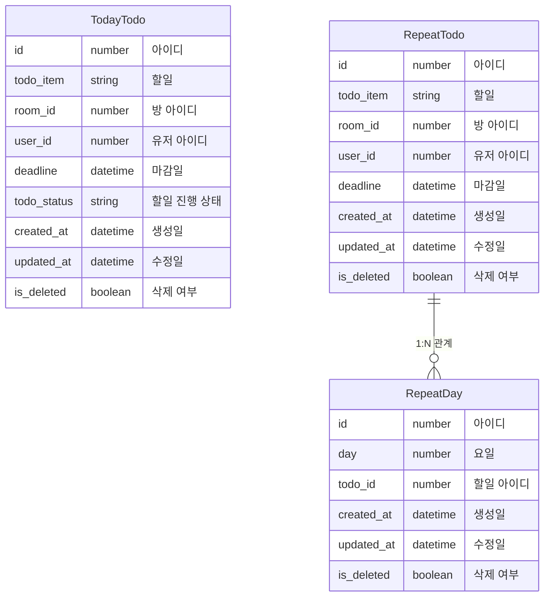
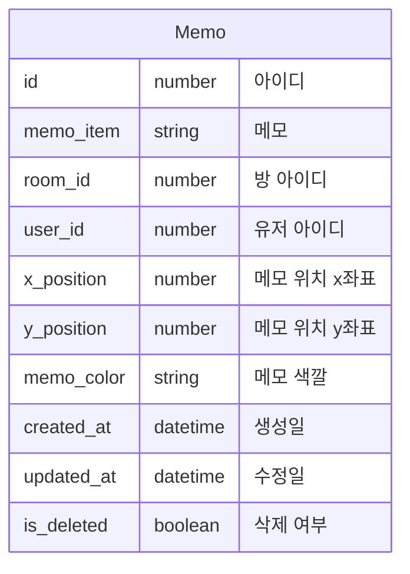
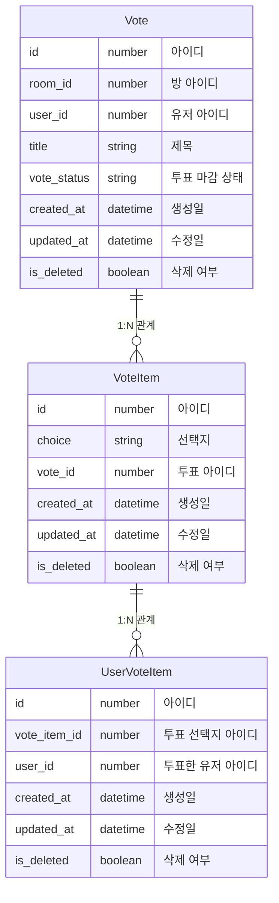
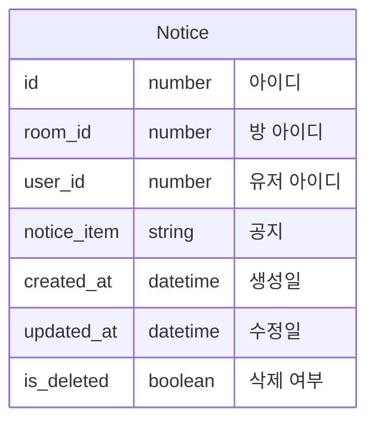
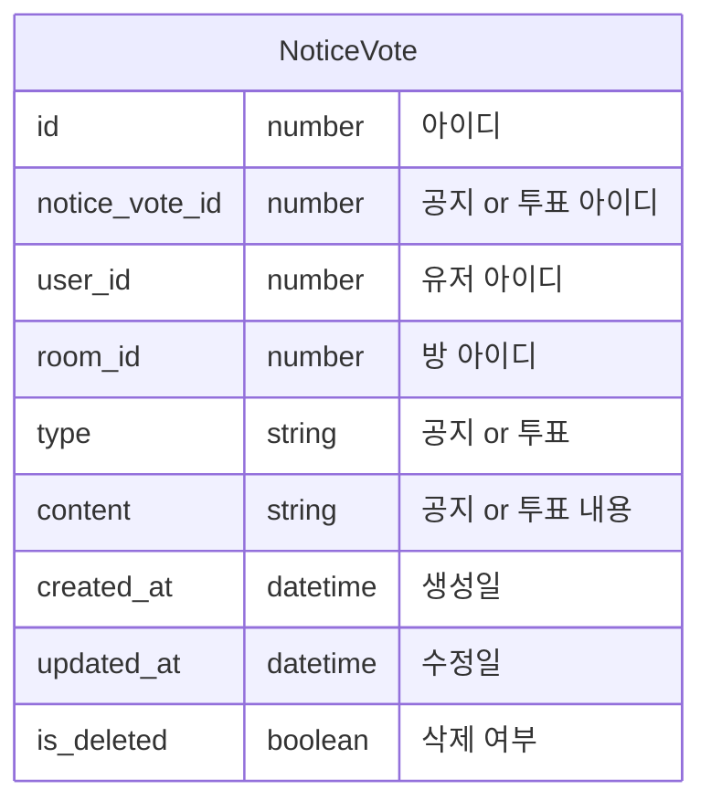
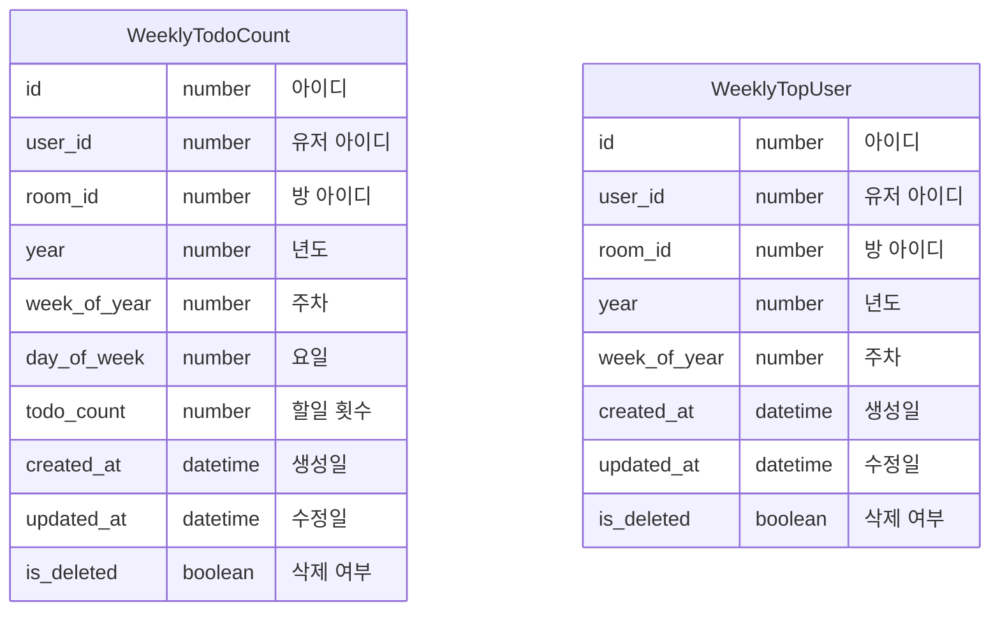
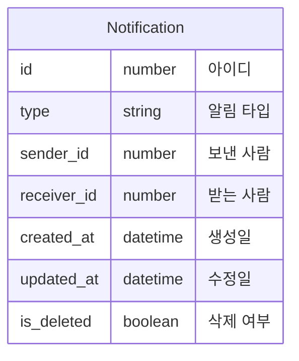

## 유저

``` mermaid
erDiagram
    User {
      id number "아이디"
      name string "이름"
      nickname string "별명"
      email string "이메일"
      password string "비밀번호"
      phone_number string "전화번호"
      profile_image string "프로필 이미지 링크"
      sns_provider string "가입한 SNS 업체"
      created_at datetime "생성일"  
      updated_at datetime "수정일"
      is_deleted boolean "삭제 여부"
}
```

## 방

```mermaid
erDiagram
    UserRoom {
        id number "아이디"
        user_id number "유저 아이디"
        room_id number "방 아이디"
        created_at datetime "생성일"
        updated_at datetime "수정일"
        is_deleted boolean "삭제 여부"
    }

    Room {
        id number "아이디"
        name string "이름"
        color string "색깔"
        created_at datetime "생성일"
        updated_at datetime "수정일"
        is_deleted boolean "삭제 여부"
    }

    Room ||--o{ UserRoom : "1:N 관계"
```

## 할일

```mermaid
erDiagram
  TodayTodo {
	  id number "아이디"
	  todo_item string "할일"
	  room_id number "방 아이디"
	  user_id number "유저 아이디"
	  deadline  datetime "마감일"
	  todo_status string "할일 진행 상태"
	  created_at datetime "생성일"  
    updated_at datetime "수정일"
    is_deleted boolean "삭제 여부"
  }
  
  RepeatTodo {
	  id number "아이디"
	  todo_item string "할일"
	  room_id number "방 아이디"
	  user_id number "유저 아이디"
	  deadline  datetime "마감일"
	  created_at datetime "생성일"  
    updated_at datetime "수정일"
    is_deleted boolean "삭제 여부"
  }
  
  RepeatDay {
	  id number "아이디"
	  day number "요일"
	  todo_id number "할일 아이디"
	  created_at datetime "생성일"  
    updated_at datetime "수정일"
    is_deleted boolean "삭제 여부"
  }
  
	RepeatTodo ||--o{ RepeatDay : "1:N 관계"
```

## 메모

```mermaid
erDiagram
  Memo {
	  id number "아이디"
	  memo_item string "메모"
		room_id number "방 아이디"
	  user_id number "유저 아이디"
	  x_position number "메모 위치 x좌표"
	  y_position number "메모 위치 y좌표"
	  memo_color string "메모 색깔"
	  created_at datetime "생성일"  
    updated_at datetime "수정일"
    is_deleted boolean "삭제 여부"
  }

```

## 투표

```mermaid
erDiagram
  Vote {
	  id number "아이디"
		room_id number "방 아이디"
	  user_id number "유저 아이디"
	  title string "제목"
	  vote_status string "투표 마감 상태"
	  created_at datetime "생성일"  
    updated_at datetime "수정일"
    is_deleted boolean "삭제 여부"
  }
  
  VoteItem {
	  id number "아이디"
		choice string "선택지"
		vote_id number "투표 아이디"
	  created_at datetime "생성일"  
    updated_at datetime "수정일"
    is_deleted boolean "삭제 여부"
  }
  
  UserVoteItem {
	  id number "아이디"
		vote_item_id number "투표 선택지 아이디"
		user_id number "투표한 유저 아이디"
	  created_at datetime "생성일"  
    updated_at datetime "수정일"
    is_deleted boolean "삭제 여부"
  }
 
	Vote ||--o{ VoteItem : "1:N 관계"
	VoteItem ||--o{ UserVoteItem : "1:N 관계"
```

## 공지

```mermaid
erDiagram
  Notice {
	  id number "아이디"
		room_id number "방 아이디"
	  user_id number "유저 아이디"
		notice_item string "공지"
	  created_at datetime "생성일"  
    updated_at datetime "수정일"
    is_deleted boolean "삭제 여부"
  }

```

## 공지 & 투표

```mermaid
erDiagram
	NoticeVote {
	  id number "아이디"
	  notice_vote_id number "공지 or 투표 아이디"
	  user_id number "유저 아이디"
	  room_id number "방 아이디"
	  type string "공지 or 투표"
	  content string "공지 or 투표 내용"
	  created_at datetime "생성일"  
	  updated_at datetime "수정일"
	  is_deleted boolean "삭제 여부"
  }
```

## 통계

```mermaid
erDiagram
	WeeklyTodoCount {
	  id number "아이디"
	  user_id number "유저 아이디"
	  room_id number "방 아이디"
	  year number "년도"
	  week_of_year number "주차"
	  day_of_week number "요일"
	  todo_count number "할일 횟수"
	  created_at datetime "생성일"  
	  updated_at datetime "수정일"
	  is_deleted boolean "삭제 여부"
  }
  
	WeeklyTopUser {
	  id number "아이디"
	  user_id number "유저 아이디"
	  room_id number "방 아이디"
	  year number "년도"
	  week_of_year number "주차"
	  created_at datetime "생성일"  
	  updated_at datetime "수정일"
	  is_deleted boolean "삭제 여부"
  }
```

## 알림

```mermaid
erDiagram
	Notification {
	  id number "아이디"
	  type string "알림 타입"
	  sender_id number "보낸 사람"
	  receiver_id number "받는 사람"
	  created_at datetime "생성일"  
	  updated_at datetime "수정일"
	  is_deleted boolean "삭제 여부"
  }
```